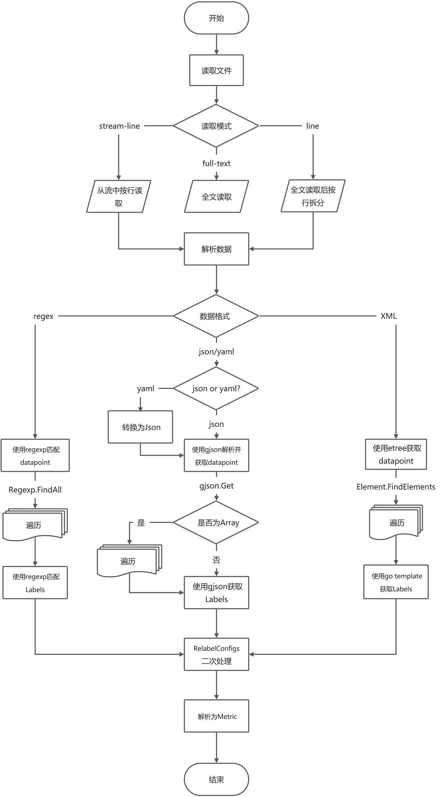

# Prometheus Common Data Exporter

[][hub]
[][gitee]

Prometheus Common Data Exporter is used to parse JSON, XML, yaml or other format data from multiple sources (such as
HTTP response message, local file, TCP response message and UDP response message) into Prometheus metric data.

[English](./README-en.md)  |  [简体中文](./README.md)

### Building the software

#### Local Build

```shell
make 
```

#### Building with Docker

```shell
make && docker build -t data_exporter:0.2.0 .
```

### Running this software

#### From binaries

```shell
./data_exporter --config.file="data_exporter.yaml"
```

#### debug config file

```shell
./data_exporter --config.file="data_exporter.yaml" --log.level=debug
```

#### running examples

```shell
cd examples
nohup python3 -m http.server -b 127.0.0.1 10101 &  # Start an HTTP background service and remember to stop when the test is over
../data_exporter
# new window
curl 127.0.0.1:9116/metrics
```

#### Using the docker image

```shell
docker run --rm -d -p 9116:9116 --name data_exporter -v `pwd`:/etc/data_exporter/ microops/data_exporter:0.2.0 --config.file=/etc/data_exporter/config.yml
```

### Configuration

```yaml
collects:
  - name: "test-http"
    relabel_configs: [ ]
    data_format: "json" # data format/Data matching mode
    datasource:
      - type: "file"
        url: "../examples/my_data.json"
      - type: "http"
        url: "https://localhost/examples/my_data.json"
        relabel_configs: [ ]
    metrics: # metric matching pattern
      - name: "Point1"
        relabel_configs: # Conduct secondary processing according to the matched data and labels, like Prometheus relabel_configs
          - source_labels: [ __name__ ]
            target_label: name
            regex: "([^.]+)\\.metrics\\..+"
            replacement: "$1"
            action: replace
          - source_labels: [ __name__ ]
            target_label: __name__
            regex: "[^.]+\\.metrics\\.(.+)"
            replacement: "server_$1"
            action: replace
        match: # matching pattern
          datapoint: "data|@expand|@expand|@to_entries:name:value" # Data block matching, each data block is the original data of an indicator
          labels: # Label matching
            __value__: "value"
            __name__: "name"
```

### 流程



### 数据源

#### file

```yaml
datasource:
  - type: "file"
    name: <string> # datasource name 
    max_content_length: <int> # The maximum read length, in bytes, defaults: 102400000
    relabel_configs: [ <relabel_config>, ... ] # reference: https://prometheus.io/docs/prometheus/latest/configuration/configuration/#relabel_config
    timeout: <duration>  # The default is "30s", which cannot be less than "1ms", reference: https://prometheus.io/docs/prometheus/latest/configuration/configuration/#duration
    read_mode: <string> # read mode, The value can be: "stream-line" or "full-text", defaults: "full-text"
    url: "../examples/weather.xml"
```

#### http

```yaml
datasource:
  - type: "http"
    name: <string> # datasource name 
    max_content_length: <int> # The maximum read length, in bytes, defaults: 102400000
    relabel_configs: [ <relabel_config>, ... ] # reference: https://prometheus.io/docs/prometheus/latest/configuration/configuration/#relabel_config
    timeout: <duration>  # The default is "30s", which cannot be less than "1ms", reference: https://prometheus.io/docs/prometheus/latest/configuration/configuration/#duration
    read_mode: <string> # read mode, The value can be: "stream-line" or "full-text", defaults: "full-text"
    url: "http://127.0.0.1:2001/weather.xml"
    http:
      # Optional HTTP basic authentication information.
      basic_auth:
        username: <string>
        password: <secret>
        password_file: <string>
      # Optional `Authorization` header configuration.
      authorization:
        type: <string> # Sets the authentication type.default: Bearer
        # Sets the credentials. It is mutually exclusive with `credentials_file`.
        credentials: <secret>
        # Sets the credentials to the credentials read from the configured file.
        # It is mutually exclusive with `credentials`.
        credentials_file: <filename>
      # Optional OAuth 2.0 configuration. reference: https://prometheus.io/docs/prometheus/latest/configuration/configuration/#oauth2
      oauth2: <oauth2>
      # Optional proxy URL.
      proxy_url: <string>
      # Configure whether HTTP requests follow HTTP 3xx redirects. default: true
      follow_redirects: <bool>
      # TLS configuration. reference: https://prometheus.io/docs/prometheus/latest/configuration/configuration/#tls_config
      tls_config: <tls_config>
      body: string # HTTP request body
      headers: { <string>: <string>, ... } # custom HTTP request headers
      method: <string> #HTTP request method, example: GET/POST/PUT...
      valid_status_codes: [ <number>,... ] # valid status code,default to 200~299.
```

#### tcp

```yaml
datasource:
  - type: "tcp"
    name: <string> # datasource name 
    max_content_length: <int> # The maximum read length, in bytes, defaults: 102400000
    relabel_configs: [ <relabel_config>, ... ] # reference: https://prometheus.io/docs/prometheus/latest/configuration/configuration/#relabel_config
    timeout: <duration>  # The default is "30s", which cannot be less than "1ms", reference: https://prometheus.io/docs/prometheus/latest/configuration/configuration/#duration
    read_mode: <string> # read mode, The value can be: "stream-line" or "full-text", defaults: "full-text"
    url: "127.0.0.1:2001"
    tcp:
      # TLS configuration. reference: https://prometheus.io/docs/prometheus/latest/configuration/configuration/#tls_config
      tls_config: <tls_config>
      send: # The value can be string、[string,...]、{"msg": <string>,"delay": <duration>}、[{"msg": <string>,"delay": <duration>},...]
        - msg: <string>  # message
          # The waiting time after sending is 0 by default, and the total delay must not be greater than timeout
          # reference: https://prometheus.io/docs/prometheus/latest/configuration/configuration/#duration
          delay: <duration>
      max_connect_time: <duration> # The maximum time to establish a connection (excluding data transmission). If the connection is not established successfully after this time, a failure will be returned. Default to 3s
      max_transfer_time: <duration> # Maximum message transmission time. If the message transmission exceeds this time, it will stop reading and close the connection. Default to 3s
      end_of: # Message end flag. When this flag is read, it will stop reading and close the connection. The message is line buffered, so end_ The value of of cannot be multiple rows.
```

Note: `end_of` and `max_transfer_time` is used to control closing the connection (message transmission is completed).
When the flag of `end_of` is matched or the transmission time reaches the value of `max_transfer_time`, the connection
will be closed and data reception will be stopped, but no exception will be thrown. It is recommended to mainly
use `end_of` to control and increase the value of `max_transfer_time`.

#### udp

```yaml
datasource:
  - type: "udp"
    name: <string> # datasource name 
    max_content_length: <int> # The maximum read length, in bytes, defaults: 102400000
    relabel_configs: [ <relabel_config>, ... ] # reference: https://prometheus.io/docs/prometheus/latest/configuration/configuration/#relabel_config
    timeout: <duration>  # The default is "30s", which cannot be less than "1ms", reference: https://prometheus.io/docs/prometheus/latest/configuration/configuration/#duration
    read_mode: <string> # read mode, The value can be: "stream-line" or "full-text", defaults: "full-text"
    url: "127.0.0.1:2001"
    udp:
      send: # The value can be string、[string,...]、{"msg": <string>,"delay": <duration>}、[{"msg": <string>,"delay": <duration>},...]
        - msg: <string>  # message
          # The waiting time after sending is 0 by default, and the total delay must not be greater than timeout
          # reference: https://prometheus.io/docs/prometheus/latest/configuration/configuration/#duration
          delay: <duration>
      max_connect_time: <duration> # The maximum time to establish a connection (excluding data transmission). If the connection is not established successfully after this time, a failure will be returned. Default to 3s
      max_transfer_time: <duration> # Maximum message transmission time. If the message transmission exceeds this time, it will stop reading and close the connection. Default to 3s
      end_of: # Message end flag. When this flag is read, it will stop reading and close the connection. The message is line buffered, so end_ The value of of cannot be multiple rows.
```

Note: UDP does not support TLS temporarily

### Labels说明

It generally follows the specification of Prometheus, but contains several additional special labels:

- `__namespace__`、`__subsystem__`、`__name__`
    - The values of `__namespace__` and  `__subsystem__` are optional
    - The value of `__name__` is required
    - Underline `__namespace__`、`__subsystem__` and `__name__`, FQDN constituting metric (metric name)
- `__value__`: required, metric value
- `__time_format__`、`__time__`
    - The values of `__time_format__` are optional
    - The values of`__time__` is required, If the value is empty or does not match the timestamp, the corresponding
      metric data will not carry the time
    - When the value of `__time__` is a UNIX (second, millisecond, or nanosecond) timestamp (string), you do not need to
      specify `__time_format__`
    - When the value of `__time__` is a time string in rfc3339nano (rfc3339 compatible) format, `__time_format__` does
      not need to be specified
    - When the value of `__time__` is a time string in other formats, `__time_format__` needs to be
      specified（reference: [go source code](https://golang.org/src/time/format.go) ）
- `__help__`: optional，Metric help info

### relabel_configs

Refer to the official Prometheus
documentation: [relabel_config](https://prometheus.io/docs/prometheus/latest/configuration/configuration/#relabel_config)

### Metric Matching syntax

- datapoint: Data point / block matching. Each data point / block is the original data of an indicator
    - If the value is empty, all data is matched
- labels: map type, key is label key, and value is the matched label value. If there are multiple results, only the
  first result will be obtained

### Data matching mode

#### json

##### Example

- raw data

```json
{
  "code": 0,
  "data": {
    "server1": {
      "metrics": {
        "CPU": "16",
        "Memory": 68719476736
      }
    },
    "server2": {
      "metrics": {
        "CPU": "8",
        "Memory": 34359738368
      }
    }
  }
}
```

- Configuration

```yaml
match:
  datapoint: "data|@expand|@expand|@to_entries:name:value"
  labels:
    __value__: "value"
    __name__: "name"
```

##### explain

- Generally follow the [gjson](https://gjson.dev/) syntax
- add modifiers: expand
    - Expand the map one layer. See the following for details
- add modifiers: to_entries
    - Convert map to array. See the following for details

###### expand

- raw data:

```json
{
  "server1": {
    "metrics": {
      "CPU": "16",
      "Memory": 68719476736
    }
  },
  "server2": {
    "metrics": {
      "CPU": "8",
      "Memory": 34359738368
    }
  }
}
```

use `@expand`:

```json
{
  "server1.metrics": {
    "CPU": "16",
    "Memory": 68719476736
  },
  "server2.metrics": {
    "CPU": "8",
    "Memory": 34359738368
  }
}
```

###### to_entries

- raw data:

```json
{
  "server1": {
    "metrics": {
      "CPU": "16",
      "Memory": 68719476736
    }
  },
  "server2": {
    "metrics": {
      "CPU": "8",
      "Memory": 34359738368
    }
  }
}
```

- use `@to_entries`:

```json
[
  {
    "key": "server1",
    "value": {
      "metrics": {
        "CPU": "16",
        "Memory": 68719476736
      }
    }
  },
  {
    "key": "server2",
    "value": {
      "metrics": {
        "CPU": "8",
        "Memory": 34359738368
      }
    }
  }
]
```

- use `@to_entries:name:val`:

```json
[
  {
    "name": "server1",
    "val": {
      "metrics": {
        "CPU": "16",
        "Memory": 68719476736
      }
    }
  },
  {
    "name": "server2",
    "val": {
      "metrics": {
        "CPU": "8",
        "Memory": 34359738368
      }
    }
  }
]
```

- use `@to_entries:-:val`:

```json
[
  {
    "metrics": {
      "CPU": "16",
      "Memory": 68719476736
    }
  },
  {
    "metrics": {
      "CPU": "8",
      "Memory": 34359738368
    }
  }
]
```

use `@to_entries::-`:

```json
[
  "server1",
  "server2"
]
```

#### yaml

Yaml will be converted into JSON internally, and then processed. Please refer to the JSON section

#### xml

XML parsing based on [etree library](https://github.com/beevik/etree).

- Configuration:

```yaml
- name: "weather - week"
  match:
    datapoint: "//china[@dn='week']/city/weather"
    labels:
      __value__: "{{ .Text }}"
      name: '{{ ((.FindElement "../").SelectAttr "quName").Value }}'
      __name__: "week"
      path: "{{ .GetPath }}"
```

- Configuration description
    - `datapoint`: use the [etree.Element.FindElements](https://github.com/beevik/etree#path-queries) to find.
    - `labels`: Parsing data using `go template` syntax，metadata
      is [etree.Element](https://pkg.go.dev/github.com/beevik/etree#Element) Object

#### regex

Regular expression matching using Perl syntax.

```yaml
- name: "server cpu"
  relabel_configs:
    - source_labels: [ __raw__ ]
      target_label: __value__
      regex: ".*cpu=(.+?)[!/].*"
    - source_labels: [ __raw__ ]
      target_label: name
      regex: ".*@\\[(.+?)].*"
    - target_label: __name__
      replacement: "cpu"
  match:
    datapoint: "@.*!"
    labels:
      __raw__: ".*"
```

- If you want to match across rows, you need to use `(? S:.+)`in this way. Mark `s` to allow `.` to support line
  feed (`\n`)

##### Named group matching

```yaml
- name: regex - memory
  relabel_configs:
    - target_label: __name__
      replacement: memory
  match:
    datapoint: '@\[(?P<name>.+?)].*/ts=(?P<__time__>[0-9]+)/.*!'
    labels:
      __value__: memory=(?P<__value__>[\d]+)
```

- When using named matching for labels, the name must be consistent with the label name, otherwise the whole result will
  be matched

[hub]: https://hub.docker.com/layers/microops/data_exporter

[gitee]: https://gitee.com/MicroOps/data_exporter