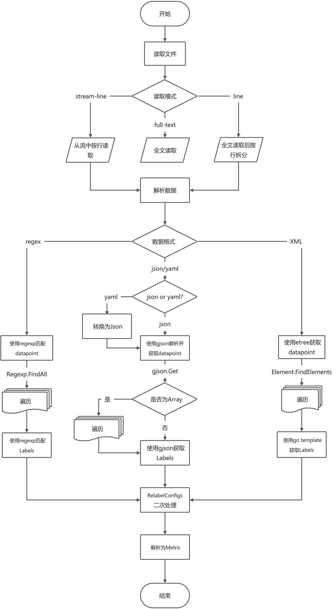

### 编译

```shell
make 
```

### 运行

```shell

```

### 配置

```yaml
collects:
  - name: "test-http"
    relabel_configs: [ ]
    data_format: "json"
    datasource:
      - type: "file"
        url: "../examples/my_data.json"
      - type: "http"
        url: "https://localhost/examples/my_data.json"
        relabel_configs: [ ]
    metrics:
      - name: "Point1"
        relabel_configs: # 根据匹配到数据及标签，进行二次处理，和Prometheus的relabel_configs用法一致
          - source_labels: [ __name__ ]
            target_label: name
            regex: "([^.]+)\\.metrics\\..+"
            replacement: "$1"
            action: replace
          - source_labels: [ __name__ ]
            target_label: __name__
            regex: "[^.]+\\.metrics\\.(.+)"
            replacement: "server_$1"
            action: replace
        match: # 匹配规则
          datapoint: "data|@expand|@expand|@to_entries:name:value" # 数据块匹配，每一个数据块就是一个指标的原始数据
          labels: # 标签匹配
            __value__: "value"
            __name__: "name"
```

### 流程



### Labels

总体遵循prometheus的规范, 几个特殊的label

- `__namespace__`、`__subsystem__`、`__name__`
    - `__namespace__`、`__subsystem__` 的值为可选项
    - `__name__` 的值为必选项
    - `__namespace__`、`__subsystem__`、`__name__`使用下划线进行连接，组成metric的fqDN（metric name）
- `__value__`: 必选， metric值
- `__time_format__`、`__time__`
    - `__time_format__`的值为可选项
    - `__time__` 的值为必选项
    - `__time__` 的值为unix（秒、毫秒或纳秒）时间戳(字符串)时，不需要指定`__time_format__`
    - `__time__` 的值为 RFC3339Nano（兼容RFC3339）格式的时间字符串时，不需要指定`__time_format__`
    - `__time__` 的值为其它格式的时间字符串时，需要指定`__time_format__`（参考 [go源代码](https://golang.org/src/time/format.go) ）
- `__help__`: 可选，Metric帮助信息

### 匹配语法

- datapoint: 数据点/块匹配，每一个数据点/块就是一个指标的原始数据
    - 如果值为空，则匹配全部数据
- labels: map类型，key为label key, value为匹配到的label value，如果有多个结果，只会获取第一个结果

### json

#### 示例

- 数据

```json
{
  "code": 0,
  "data": {
    "server1": {
      "metrics": {
        "CPU": "16",
        "Memory": 68719476736
      }
    },
    "server2": {
      "metrics": {
        "CPU": "8",
        "Memory": 34359738368
      }
    }
  }
}
```

- 配置

```yaml
match: # 匹配规则
  datapoint: "data|@expand|@expand|@to_entries:name:value"
  labels:
    __value__: "value"
    __name__: "name"
```

#### 说明

- 总体遵循 [gjson](https://gjson.dev/) 语法
- 增加 modifiers: expand
    - 将map展开一层，具体说明见下文
- 增加 modifiers: to_entries
    - 将map转换为array，具体说明见下文

##### expand

原始数据:

```json
{
  "server1": {
    "metrics": {
      "CPU": "16",
      "Memory": 68719476736
    }
  },
  "server2": {
    "metrics": {
      "CPU": "8",
      "Memory": 34359738368
    }
  }
}
```

使用`@expand`展开后数据:

```json
{
  "server1.metrics": {
    "CPU": "16",
    "Memory": 68719476736
  },
  "server2.metrics": {
    "CPU": "8",
    "Memory": 34359738368
  }
}
```

##### to_entries

原始数据:

```json
{
  "server1": {
    "metrics": {
      "CPU": "16",
      "Memory": 68719476736
    }
  },
  "server2": {
    "metrics": {
      "CPU": "8",
      "Memory": 34359738368
    }
  }
}
```

使用`@to_entries`展开后数据:

```json
[
  {
    "key": "server1",
    "value": {
      "metrics": {
        "CPU": "16",
        "Memory": 68719476736
      }
    }
  },
  {
    "key": "server2",
    "value": {
      "metrics": {
        "CPU": "8",
        "Memory": 34359738368
      }
    }
  }
]
```

使用`@to_entries:name:val`展开后数据:

```json
[
  {
    "name": "server1",
    "val": {
      "metrics": {
        "CPU": "16",
        "Memory": 68719476736
      }
    }
  },
  {
    "name": "server2",
    "val": {
      "metrics": {
        "CPU": "8",
        "Memory": 34359738368
      }
    }
  }
]
```

使用`@to_entries:-:val`展开后数据:

```json
[
  {
    "metrics": {
      "CPU": "16",
      "Memory": 68719476736
    }
  },
  {
    "metrics": {
      "CPU": "8",
      "Memory": 34359738368
    }
  }
]
```

使用`@to_entries::-`展开后数据:

```json
[
  "server1",
  "server2"
]
```

### yaml

内部会将yaml转换为json，再进行处理，请参考json部分

### xml

基于etree库进行xml解析，

- 配置:

```yaml
- name: "weather - week"
  match:
    datapoint: "//china[@dn='week']/city/weather"
    labels:
      __value__: "{{ .Text }}"
      name: '{{ ((.FindElement "../").SelectAttr "quName").Value }}'
      __name__: "week"
      path: "{{ .GetPath }}"
```

- 配置说明
    - `datapoint`: 使用etree.Element.FindElements进行文档查找，
    - `labels`: 使用go template语法，进行数据解析，元数据为etree.Element对象

# regex

Perl语法的正则表达式匹配

```yaml
- name: "server cpu"
  relabel_configs:
    - source_labels: [ __raw__ ]
      target_label: __value__
      regex: ".*cpu=(.+?)[!/].*"
    - source_labels: [ __raw__ ]
      target_label: name
      regex: ".*@\\[(.+?)].*"
    - target_label: __name__
      replacement: "cpu"
  match:
    datapoint: "@.*!"
    labels:
      __raw__: ".*"
```

- 如果想跨行匹配，需要使用`(?s:.+)`这种方式，标记`s`为让`.`支持换行(`\n`)