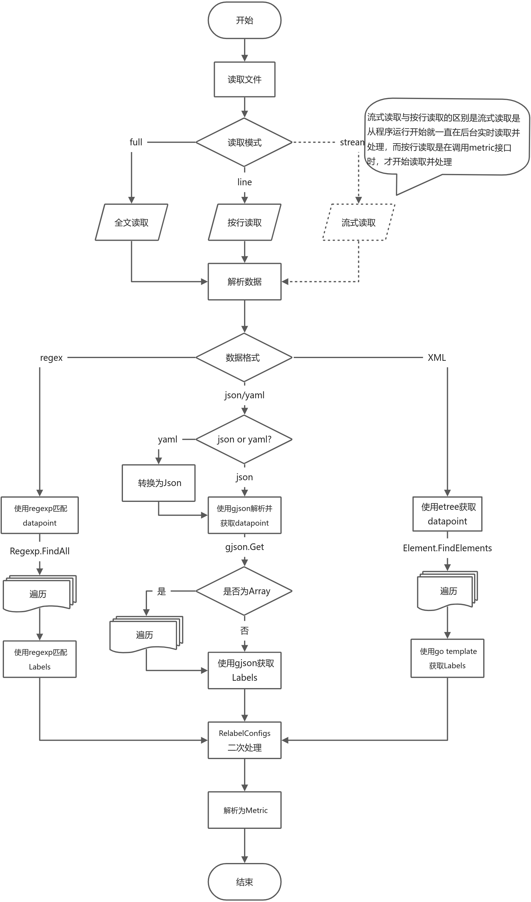

# Prometheus Common Data Exporter

[][hub]
[][gitee]

Prometheus Common Data Exporter 用于将多种来源(如http响应报文、本地文件、TCP响应报文、UDP响应报文)的Json、xml、yaml或其它格式的数据，解析为Prometheus metric数据。

Prometheus Common Data Exporter is used to parse JSON, XML, yaml or other format data from multiple sources (such as
HTTP response message, local file, TCP response message and UDP response message) into Prometheus metric data.

[English](./README-en.md)  |  [简体中文](./README.md)

### 编译

#### 通用

```shell
make common-build
```

#### 编译Docker镜像

```shell
make && docker build -t data_exporter:0.4.0 .
```

### 运行

#### 常规启动

```shell
./data_exporter --config.path="data_exporter.yaml"
```

#### 调试配置文件

```shell
./data_exporter debug --config.path="data_exporter.yaml"
```

#### 启动examples

```shell
cd examples
nohup python3 -m http.server -b 127.0.0.1 10101 &  # 启动一个http后台服务, 测试结束记得停止
../data_exporter
# 新窗口执行 
curl 127.0.0.1:9116/metrics
```

#### 使用Docker运行

```shell
git clone https://github.com/MicroOps-cn/data_exporter
cd data_exporter/examples/
sed -i 's#../examples/#/etc/data_exporter/#g' data_exporter.yaml
docker run  -itd -p 9116:9116 -v `pwd`:/etc/data_exporter/ --name data_exporter microops/data_exporter:0.4.0 --config.path=/etc/data_exporter/data_exporter.yaml
docker logs data_exporter
```

### 配置

```yaml
collects:
  - name: "test-http"
    relabel_configs: [ ]
    data_format: "json" # 原数据格式/数据匹配模式
    datasource:
      - type: "file"
        url: "../examples/my_data.json"
      - type: "http"
        url: "https://localhost/examples/my_data.json"
        relabel_configs: [ ]
    metrics: # metric 匹配规则
      - name: "Point1"
        relabel_configs: # 根据匹配到数据及标签，进行二次处理，和Prometheus的relabel_configs用法一致
          - source_labels: [ __name__ ]
            target_label: name
            regex: "([^.]+)\\.metrics\\..+"
            replacement: "$1"
            action: replace
          - source_labels: [ __name__ ]
            target_label: __name__
            regex: "[^.]+\\.metrics\\.(.+)"
            replacement: "server_$1"
            action: replace
        match: # 匹配规则
          datapoint: "data|@expand|@expand|@to_entries:name:value" # 数据块匹配，每一个数据块就是一个指标的原始数据
          labels: # 标签匹配
            __value__: "value"
            __name__: "name"
```

### 流程



### 数据源

#### file

```yaml
datasource:
  - type: "file"
    name: <string> # 数据源名称
    relabel_configs: [ <relabel_config>, ... ] # 参考https://prometheus.io/docs/prometheus/latest/configuration/configuration/#relabel_config
    timeout: <duration>  # 默认为30s，不能小于1ms，参考https://prometheus.io/docs/prometheus/latest/configuration/configuration/#duration
    read_mode: <string> # 读取模式，stream | line | full，默认为full
    url: "../examples/weather.xml"
    end_of: # 报文结束标志，当读取到该标志，则会停止继续读取并关闭连接。报文为行缓冲，所以end_of的值不能为多行。
    max_content_length: <int> # 读取最大长度，单位为字节， 如果"read_mode"值为stream, 该值默认为0 (不限制),否则默认值为 102400000  
    line_max_content_length: <int> # 每行最大读取量字节数,0为不限制,默认为: 102400000
    line_separator: [<string>,...] # 行分隔符, 值类型可以为 string、[string,...], 默认为: "\n"
```

#### http

```yaml
datasource:
  - type: "http"
    name: <string> # 数据源名称
    relabel_configs: [ <relabel_config>, ... ] # 参考https://prometheus.io/docs/prometheus/latest/configuration/configuration/#relabel_config
    timeout: <duration>  # 默认为30s，不能小于1ms，参考https://prometheus.io/docs/prometheus/latest/configuration/configuration/#duration
    read_mode: <string> # 读取模式，stream | line | full，默认为full
    url: "http://127.0.0.1:2001/weather.xml"
    config:
      # HTTP basic 认证信息
      basic_auth:
        username: <string>
        password: <secret>
        password_file: <string>
      # `Authorization` 头配置
      authorization:
        type: <string> # 类型，默认为 Bearer
        credentials: <secret>
        credentials_file: <filename>
      oauth2: <oauth2> # oauth2配置，参考文档: https://prometheus.io/docs/prometheus/latest/configuration/configuration/#oauth2
      proxy_url: <string> # 代理地址
      follow_redirects: <bool> # 是否跟随重定向，默认为true
      tls_config: <tls_config> # TLS配置 参考文档: https://prometheus.io/docs/prometheus/latest/configuration/configuration/#tls_config
      body: string # HTTP请求报文
      headers: { <string>: <string>, ... } # 自定义HTTP头
      method: <string> #HTTP请求方法 GET/POST/PUT...
      valid_status_codes: [ <number>,... ] # 有效的状态码,默认为200~299
    line_separator: [<string>,...] # 行分隔符, 值类型可以为 string、[string,...], 默认为: "\n"
    end_of: # 报文结束标志，当读取到该标志，则会停止继续读取并关闭连接。报文为行缓冲，所以end_of的值不能为多行。
    max_content_length: <int> # 读取最大长度，单位为字节， 如果"read_mode"值为stream, 该值默认为0 (不限制),否则默认值为 102400000  
    line_max_content_length: <int> # 每行最大读取量字节数,0为不限制,默认为: 102400000
```

#### tcp

```yaml
datasource:
  - type: "tcp"
    name: <string> # 数据源名称
    relabel_configs: [ <relabel_config>, ... ] # 参考https://prometheus.io/docs/prometheus/latest/configuration/configuration/#relabel_config
    timeout: <duration>  # 默认为30s，不能小于1ms，参考https://prometheus.io/docs/prometheus/latest/configuration/configuration/#duration
    read_mode: <string> # 读取模式，stream | line | full，默认为full
    url: "127.0.0.1:2001"
    config:
      tls_config: <tls_config> # TLS配置 参考文档: https://prometheus.io/docs/prometheus/latest/configuration/configuration/#tls_config
      send: # send的值类型可以为 string、[string,...]、{"msg": <string>,"delay": <duration>}、[{"msg": <string>,"delay": <duration>},...]
        - msg: <string>  # 发送消息
          delay: <duration>  # 发送后等待时间，默认为0，延迟总和不得大于timeout，参考https://prometheus.io/docs/prometheus/latest/configuration/configuration/#duration
      max_connect_time: <duration> # 最大建立连接的时长（不包含数据传输），如果超过该时间连接仍未建立成功，会返回失败。默认为3秒
      max_transfer_time: <duration> # 报文传输最大时长，报文传输超过该时长，会停止继续读取并关闭连接。
    line_separator: [<string>,...] # 行分隔符, 值类型可以为 string、[string,...], 默认为: "\n"
    end_of: # 报文结束标志，当读取到该标志，则会停止继续读取并关闭连接。报文为行缓冲，所以end_of的值不能为多行。
    max_content_length: <int> # 读取最大长度，单位为字节， 如果"read_mode"值为stream, 该值默认为0 (不限制),否则默认值为 102400000  
    line_max_content_length: <int> # 每行最大读取量字节数,0为不限制,默认为: 102400000
```

注：end_of和max_transfer_time用来控制关闭连接(报文传输完成)。当匹配到end_of的标志，或传输时间达到max_transfer_time的值，会关闭连接，停止接收数据，但不会抛出异常。
建议主要使用end_of来控制，并增大max_transfer_time的值。

#### udp

```yaml
datasource:
  - type: "udp"
    name: <string> # 数据源名称
    relabel_configs: [ <relabel_config>, ... ] # 参考https://prometheus.io/docs/prometheus/latest/configuration/configuration/#relabel_config
    timeout: <duration>  # 默认为30s，不能小于1ms，参考https://prometheus.io/docs/prometheus/latest/configuration/configuration/#duration
    read_mode: <string> # 读取模式，stream | line | full，默认为full
    url: "127.0.0.1:2001"
    config:
      send: # send的值类型可以为 string、[string,...]、{"msg": <string>,"delay": <duration>}、[{"msg": <string>,"delay": <duration>},...]
        - msg: <string>  # 发送消息
          delay: <duration>  # 发送后等待时间，默认为0，延迟总和不得大于timeout，参考https://prometheus.io/docs/prometheus/latest/configuration/configuration/#duration
      max_connect_time: <duration> # 最大建立连接的时长（不包含数据传输），如果超过该时间连接仍未建立成功，会返回失败。默认为3秒
      max_transfer_time: <duration> # 报文传输最大时长，报文传输超过该时长，会停止继续读取并关闭连接。
      end_of: # 报文结束标志，当读取到该标志，则会停止继续读取并关闭连接。报文为行缓冲，所以end_of的值不能为多行。
    line_separator: [<string>,...] # 行分隔符, 值类型可以为 string、[string,...], 默认为: "\n"
    end_of: # 报文结束标志，当读取到该标志，则会停止继续读取并关闭连接。报文为行缓冲，所以end_of的值不能为多行。
    max_content_length: <int> # 读取最大长度，单位为字节， 如果"read_mode"值为stream, 该值默认为0 (不限制),否则默认值为 102400000  
    line_max_content_length: <int> # 每行最大读取量字节数,0为不限制,默认为: 102400000
```

注: udp暂不支持TLS

### Labels说明

总体遵循prometheus的规范, 但包含几个额外的特殊的label:

- `__namespace__`、`__subsystem__`、`__name__`
  - `__namespace__`、`__subsystem__` 的值为可选项
  - `__name__` 的值为必选项
  - `__namespace__`、`__subsystem__`、`__name__`使用下划线进行连接，组成metric的fqDN（metric name）
- `__value__`: 必选， metric值, 最终值应该为数值或者布尔值
- `__time_format__`、`__time__`
  - `__time_format__`的值为可选项
  - `__time__` 的值为可选项，如果只为空或未匹配到时间戳，则对应的metric数据不会携带时间
  - `__time__` 的值为unix（秒、毫秒或纳秒）时间戳(字符串)时，不需要指定`__time_format__`
  - `__time__` 的值为 RFC3339Nano（兼容RFC3339）格式的时间字符串时，不需要指定`__time_format__`
  - `__time__` 的值为其它格式的时间字符串时，需要指定`__time_format__`（参考 [go源代码](https://golang.org/src/time/format.go) ）
- `__help__`: 可选，Metric帮助信息

### relabel_configs
参考Prometheus官方文档 [relabel_config](https://prometheus.io/docs/prometheus/latest/configuration/configuration/#relabel_config)
总体遵循Prometheus的relabel_config的配置语法,  在relabel_config的基础上增加Action: templexec. 用于执行模板替换
#### templexec
##### 示例
- 数据
```json
{
  "code": 0,
  "data": {
    "server1": {
      "metrics": {
        "CPU": "0x10",
        "Memory": "0x1000000000"
      }
    }
  }
}
```

- 配置
```yaml
match: # 匹配规则
  datapoint: "data|@expand|@expand|@to_entries:name:value"
  labels:
    __value__: "value"
    __name__: "name"
  relabel_configs:
    - source_labels: [__value__]
      target_label: __value__
      action: templexec
      template: "{{ .|parseInt 0 64 }}"
```

##### 说明

- 使用官方库text/template 进行模板替换
- 支持的pipeline函数
  - toUpper(text string) -> string
  - toLower(text string) -> string
  - title(text string) -> string
  - reReplaceAll(pattern, repl, text string) -> string
  - now() -> time.Time
  - utcNow() -> time.Time
  - parseInt(base, bitSize int, text string) -> int64
  - parseFloat(bitSize int, text string) -> float64
  - formatInt(base int, i int64) -> string
  - formatFloat(fmt byte, prec, bitSize int, f int64) -> string
  - toString(text string) -> string
  - trimSpace(text string) -> string
  - trimLeft(cutset, text string) -> string
  - trimRight(cutset, text string) -> string
  - trimPrefix(cutset, text string) -> string
  - trimSuffix(cutset, text string) -> string

- 用法举例
  - 原始字符串:"0x11", 模板: "{{ .|parseInt 0 64 }}", 结果: "17"
  - 原始字符串:" Name-Gateway ", 模板: '{{ .|trimSpace |trimLeft "Name-"|toLower }}', 结果: "gateway"


### Metric匹配语法

- datapoint: 数据点/块匹配，每一个数据点/块就是一个指标的原始数据
  - 如果值为空，则匹配全部数据
- labels: map类型，key为label key, value为匹配到的label value，如果有多个结果，只会获取第一个结果

### 数据匹配模式

#### json

##### 示例

- 数据

```json
{
  "code": 0,
  "data": {
    "server1": {
      "metrics": {
        "CPU": "16",
        "Memory": 68719476736
      }
    },
    "server2": {
      "metrics": {
        "CPU": "8",
        "Memory": 34359738368
      }
    }
  }
}
```

- 配置
```yaml
match: # 匹配规则
  datapoint: "data|@expand|@expand|@to_entries:name:value"
  labels:
    __value__: "value"
    __name__: "name"
```

##### 说明

- 总体遵循 [gjson](https://gjson.dev/) 语法
- 增加 modifiers: expand
  - 将map展开一层，具体说明见下文
- 增加 modifiers: to_entries
  - 将map转换为array，具体说明见下文

###### expand
原始数据:
```json
{
  "server1": {
    "metrics": {
      "CPU": "16",
      "Memory": 68719476736
    }
  },
  "server2": {
    "metrics": {
      "CPU": "8",
      "Memory": 34359738368
    }
  }
}
```

使用`@expand`展开后数据:
```json
{
  "server1.metrics": {
    "CPU": "16",
    "Memory": 68719476736
  },
  "server2.metrics": {
    "CPU": "8",
    "Memory": 34359738368
  }
}
```

###### to_entries

原始数据:

```json
{
  "server1": {
    "metrics": {
      "CPU": "16",
      "Memory": 68719476736
    }
  },
  "server2": {
    "metrics": {
      "CPU": "8",
      "Memory": 34359738368
    }
  }
}
```

使用`@to_entries`展开后数据:
```json
[
  {
    "key": "server1",
    "value": {
      "metrics": {
        "CPU": "16",
        "Memory": 68719476736
      }
    }
  },
  {
    "key": "server2",
    "value": {
      "metrics": {
        "CPU": "8",
        "Memory": 34359738368
      }
    }
  }
]
```

使用`@to_entries:name:val`展开后数据:
```json
[
  {
    "name": "server1",
    "val": {
      "metrics": {
        "CPU": "16",
        "Memory": 68719476736
      }
    }
  },
  {
    "name": "server2",
    "val": {
      "metrics": {
        "CPU": "8",
        "Memory": 34359738368
      }
    }
  }
]
```

使用`@to_entries:-:val`展开后数据:
```json
[
  {
    "metrics": {
      "CPU": "16",
      "Memory": 68719476736
    }
  },
  {
    "metrics": {
      "CPU": "8",
      "Memory": 34359738368
    }
  }
]
```

使用`@to_entries::-`展开后数据:
```json
[
  "server1",
  "server2"
]
```

#### yaml

内部会将yaml转换为json，再进行处理，请参考json部分

#### xml

基于 [etree库](https://github.com/beevik/etree) 进行xml解析，
- 配置:

```yaml
- name: "weather - week"
  match:
    datapoint: "//china[@dn='week']/city/weather"
    labels:
      __value__: "{{ .Text }}"
      name: '{{ ((.FindElement "../").SelectAttr "quName").Value }}'
      __name__: "week"
      path: "{{ .GetPath }}"
```

- 配置说明
  - `datapoint`: 使用 [etree.Element.FindElements](https://github.com/beevik/etree#path-queries) 进行文档查找，
  - `labels`: 使用go template语法，进行数据解析，元数据为 [etree.Element](https://pkg.go.dev/github.com/beevik/etree#Element) 对象

#### regex

Perl语法的正则表达式匹配
```yaml
- name: "server cpu"
  relabel_configs:
    - source_labels: [ __raw__ ]
      target_label: __value__
      regex: ".*cpu=(.+?)[!/].*"
    - source_labels: [ __raw__ ]
      target_label: name
      regex: ".*@\\[(.+?)].*"
    - target_label: __name__
      replacement: "cpu"
  match:
    datapoint: "@.*!"
    labels:
      __raw__: ".*"
```

- 如果想跨行匹配，需要使用`(?s:.+)`这种方式，标记`s`为让`.`支持换行(`\n`)

##### 命名分组匹配
```yaml
- name: regex - memory
  relabel_configs:
    - target_label: __name__
      replacement: memory
  match:
    datapoint: '@\[(?P<name>.+?)].*/ts=(?P<__time__>[0-9]+)/.*!'
    labels:
      __value__: memory=(?P<__value__>[\d]+)
```

- labels使用命名匹配时，需要名称和label名称一致，否则会匹配到整个结果

[hub]: https://hub.docker.com/layers/microops/data_exporter

[gitee]: https://gitee.com/MicroOps/data_exporter
